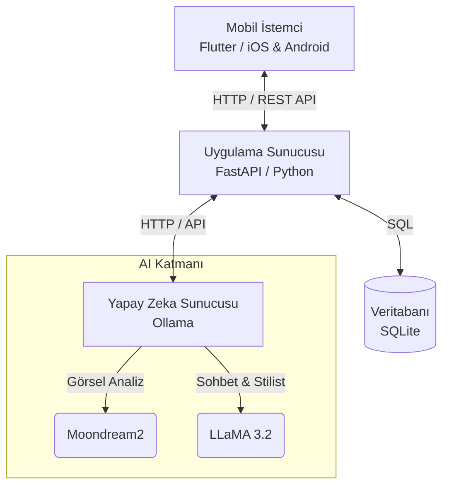
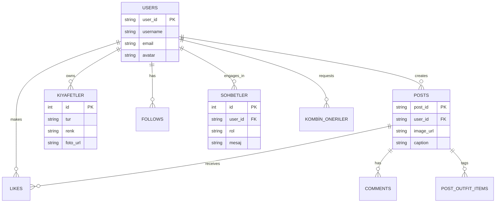

# Dijital Gardrop

**Yapay Zeka Destekli Moda Sosyal Medya Platformu**

> YZTA Bootcamp 2026 — Takım 35 Proje Raporu


Dijital Gardrop; kullanıcıların dijital gardıroplarını yönetmelerine, yapay zeka destekli kombin önerileri almalarına ve moda içeriklerini paylaşmalarına olanak tanıyan bir mobil platformdur. Sistem; **Flutter** tabanlı çok platformlu mobil istemci, **FastAPI** tabanlı RESTful arka uç ve yerel olarak çalışan **Ollama/LLaMA 3.2** dil modeli üçlüsünden oluşmaktadır.

Bu README, 4 Temmuz 2026 tarihli güncel gorev günlüğü (task log) ve sprint burndown verilerine dayanmaktadır.

---

## İçindekiler

- [Sistem Mimarisi](#sistem-mimarisi)
- [Kullanılan Teknolojiler](#kullanılan-teknolojiler)
- [Veri Modeli](#veri-modeli)
- [API Uç Noktaları](#api-uç-noktaları)
- [Yapay Zeka Entegrasyonu](#yapay-zeka-entegrasyonu)
- [Detaylı Teknik Bilgiler ve AI Altyapısı](#detaylı-teknik-bilgiler-ve-ai-altyapısı)
- [Ağ Bağlantısı ve Dağıtım](#ağ-bağlantısı-ve-dağıtım)
- [Proje Yönetimi: Görev Günlüğü ve Sprint Burndown](#proje-yönetimi-görev-günlüğü-ve-sprint-burndown)
- [Sonuç](#sonuç)
- [Kaynaklar](#kaynaklar)

---

# Dijital Gardrop - Teknik Mimari Belgesi

Bu belge, "Dijital Gardrop" (Yapay Zeka Destekli Moda Sosyal Medya Platformu) uygulamasının sistem mimarisini ve teknik altyapısını özetlemektedir.

## 1. Genel Sistem Mimarisi

Uygulama, üç ana katmandan oluşan bir istemci-sunucu (client-server) mimarisine sahiptir. İletişim, RESTful API üzerinden JSON formatında sağlanmaktadır.



## 2. Katmanlar ve Teknolojiler

### A. Mobil İstemci Katmanı (Frontend)
Kullanıcıların etkileşime girdiği çapraz platform (cross-platform) mobil uygulamadır.

- **Çerçeve (Framework):** Flutter (Sürüm 3.10+)
- **Dil:** Dart (Sürüm 3.0+)
- **Durum Yönetimi (State Management):** Riverpod (Uygulama içi veri akışı, oturum yönetimi)
- **Ağ İstekleri:** Dio / HTTP Service (Backend ile REST iletişimi)
- **Navigasyon:** GoRouter (Deklaratif sayfa yönlendirmesi)
- **Yerel Depolama:** `shared_preferences` (Oturum kalıcılığı için kullanıcı ID/token tutma)
- **Modüler Yapı (Feature-First):** Uygulama özellikleri `lib/features/` altında auth, feed, wardrobe, ai_stylist, profile gibi modüllere ayrılmıştır.

### B. Uygulama Katmanı (Backend)
İş mantığının işlendiği, veri erişiminin ve dış AI servis bağlantılarının yönetildiği katmandır.

- **Çerçeve:** FastAPI (Asenkron, hızlı, modern Python web framework'ü)
- **Dil:** Python 3.9+
- **Sunucu:** Uvicorn (ASGI web sunucusu)
- **Veritabanı:** SQLite (Geliştirme ve test kolaylığı için dosya tabanlı ilişkisel veritabanı) - `aiosqlite` ile asenkron erişim
- **Modül Mimarisi:**
  - `routers/`: API uç noktalarının (endpoints) tanımlandığı modüller (Auth, Posts, Feed, Wardrobe vb.)
  - `domain/schemas.py`: Veri doğrulama için Pydantic modelleri (Request/Response yapıları)
  - `repositories/`: Veritabanı ile etkileşim, CRUD işlemleri (Repository Pattern)
  - `services/`: İş mantığı ve dış servis entegrasyonları (Örn: Ollama entegrasyonu, dosya yükleme, mail servisleri)
  - `core/`: Yapılandırma (`.env` okuma) ve veritabanı bağlantı yönetimi.

### C. Yapay Zeka Katmanı (AI Layer)
Dış API'lere bağımlılığı (ve maliyetleri/gizlilik risklerini) ortadan kaldırmak için yerel (local) çalışan yapay zeka modelleri entegre edilmiştir.

- **Motor:** Ollama (Modelleri çalıştırmak için sunucu arayüzü)
- **Kullanılan Modeller:**
  - **LLaMA 3.2 (Text):** AI stilist sohbeti, kombin önerileri ve akıllı metin oluşturma için.
  - **Moondream2 (Vision):** Görsel analizi, yüklenen kıyafet fotoğraflarından etiket/özellik çıkarma (captioning) işlemleri için.

---

## 3. Veritabanı Şeması (Veri Modeli)

Sistem ilişkisel bir veritabanı üzerine kuruludur. Ana bileşenler ve ilişkileri şu şekildedir:




## Kullanılan Teknolojiler

| Katman | Teknoloji | Sürüm |
|---|---|---|
| Mobil İstemci | Flutter | 3.10+ |
| Dil (İstemci) | Dart | 3.0+ |
| Durum Yönetimi | Riverpod | 2.4.9 |
| Görsel Önbellek | cached_network_image | 3.3+ |
| Resim Seçici | image_picker | 1.2+ |
| Oturum Kalıcılığı | shared_preferences | 2.2+ |
| REST Arka Uç | FastAPI | 0.110+ |
| Dil (Arka Uç) | Python | 3.9+ |
| Veritabanı | SQLite | 3.x |
| ASGI Sunucusu | Uvicorn | 0.29+ |
| HTTP İstemcisi | httpx | 0.27+ |
| Statik Dosyalar | FastAPI StaticFiles | — |
| Yapay Zeka | Ollama (LLaMA 3.2) | 3.2 |

## Veri Modeli

Uygulama SQLite veritabanı üzerinde şu tablolarla çalışmaktadır:

- **users** — Kullanıcı profilleri (`user_id`, `email`, `username`, `avatar`, `bio`, `followers_count`, `following_count`, `is_private`)
- **posts** — Gönderiler (`post_id`, `user_id`, `image_url`, `caption`, `visibility`, `likes_count`, `comments_count`)
- **post_outfit_items** — Gönderi–kıyafet ilişkisi (`category` CHECK kısıtı: üst giyim, alt giyim, ayakkabı, aksesuar, dış giyim, diğer)
- **kiyafetler** — Dijital gardırop kıyafetleri (tür, renk, beden, marka, mevsim, temiz, foto_url)
- **likes** — Beğeniler (`post_id`, `user_id`)
- **follows** — Takip ilişkisi (`follower_id`, `following_id`)
- **sohbetler** — AI stilist sohbet geçmişi (`user_id`, `rol`, `mesaj`, `olusturma_zamani`)
- **kombin_oneriler** — Kombin önerileri (`user_id`, `baglam_json`, `aciklama`)
- **comments** — Yorumlar (`comment_id`, `post_id`, `user_id`, `text`, `created_at`)

## API Uç Noktaları

| Grup | Endpoint | Açıklama |
|---|---|---|
| Auth | `POST /auth/login` | Giriş |
| | `POST /auth/register` | Kayıt |
| Posts | `POST /posts` | Gönderi oluştur |
| | `DELETE /posts/{id}` | Gönderi sil |
| | `GET /posts/users/{uid}/posts` | Kullanıcı gönderileri |
| Likes | `POST /posts/{id}/like` | Beğen |
| | `DELETE /posts/{id}/like` | Beğeni kaldır |
| | `POST /posts/{id}/comments` | Yorum ekle |
| | `GET /posts/{id}/comments` | Yorumları listele |
| Feed | `GET /feed` | Akış |
| Users | `GET /users/{uid}` | Profil |
| | `PUT /users/me` | Profil güncelle |
| | `PUT /users/me/privacy` | Gizlilik ayarı |
| Follows | `POST /follow` | Takip et |
| | `DELETE /follow` | Takipten çık |
| Wardrobe | `POST /wardrobe/items` | Kıyafet ekle |
| | `GET /wardrobe/items/{uid}` | Kıyafetleri listele |
| | `POST /wardrobe/chat` | AI stilist chat |
| | `GET /wardrobe/chat/history/{uid}` | Sohbet geçmişi |
| | `POST /wardrobe/outfit/suggest` | Kombin öner |
| Captions | `POST /captions/suggest` | AI açıklama öner |
| | `POST /captions/upload` | Resim yükle |
| Static | `GET /static/uploads/{file}` | Resim sun |

## Yapay Zeka Entegrasyonu

### Ollama / LLaMA 3.2

Başlangıçta Google Gemini API kullanımı planlanmış, ancak kullanıcının yerel dil modeli tercih etmesi üzerine sistem Ollama üzerindeki LLaMA 3.2 modeline geçirilmiştir. Bu geçiş şu avantajları sağlamıştır:

- **Veri gizliliği** — istemler harici sunuculara gönderilmez.
- **Sıfır API maliyeti** — harici ücretlendirme yoktur.
- **Çevrimdışı çalışma** — internet bağlantısı gerektirmez.

### AI Stilist Chatbot

AI stilist bileşeni `gemini_client.py` modülünde uygulanmıştır. Model, Türkçe sistem promptları ile yönlendirilmekte; JSON çıktı ayrıştırma başarısız olduğunda güvenli bir geri dönüş mekanizması devreye girmektedir. İki temel işlevsellik sunulmaktadır:

```python
def sohbet_yaniti_al(gecmis, yeni_mesaj):
    # Sistem promptu + gecmis + yeni mesaj
    # JSON yanit: asistan_mesaji, baglam, hazir_mi
    ...

def kombin_onerisi_uret(baglam, temiz_kiyafetler):
    # Baglam + kiyafet listesi
    # JSON yanit: secilen_idler, aciklama
    ...
```

## Detaylı Teknik Bilgiler ve AI Altyapısı

Uygulamanın yapay zeka (AI) ve arka plan işlemleri, karmaşık ve maliyetli mimariler yerine performansı ve sadeliği önceleyen bir yaklaşımla geliştirilmiştir.

### Agent, Workflow ve Prompt Yapısı
Sistemde, tam otonom ve serbest çalışan bir "Agent" yapısı kullanılmamaktadır. Bunun yerine öngörülebilirliği artırmak amacıyla **Kural Tabanlı İş Akışı (Rule-based Workflow)** ve **Bağlam Enjeksiyonu (Context Injection)** kullanılmaktadır. 

- **İş Akışı (Workflow):** Kullanıcı bir mesaj gönderdiğinde arka plandaki NLP (Niyet Algılama) mantığı devreye girer. Kullanıcı "Kombinlerimi göster" gibi net bir komut verirse LLM hiç kullanılmadan direkt veritabanından veri çekilir. "Kombin öner" denildiğinde ise istek yerel LLM modeline (Ollama) iletilir. Sunucunun yanıt vermemesi durumunda ise sistem çökmek yerine kural tabanlı (kategorilere göre rastgele 1 alt, 1 üst, 1 ayakkabı seçen) "Smart Fallback" (Akıllı Yedek) mekanizmasını devreye sokar.
- **Prompt Mimarisi:** AI Stilist'in yönlendirilmesi için çok katı bir **Sistem Promptu** (System Prompt) yazılmıştır. Modele doğrudan profesyonel bir stilist olduğu ve **kesinlikle yapılandırılmış JSON formatında** (örneğin `"onerilen_kiyafet_idleri": [1, 2]`) cevap dönmesi gerektiği emredilmiştir. Modelin serbest metin üretmesi sınırlandırılmış, uygulamanın (Frontend) bu JSON'ı ayrıştırarak ekrana UI bileşenleri çizmesi sağlanmıştır.

### Bilgi Tabanı ve RAG (Retrieval-Augmented Generation) Kullanımı
Uygulamada Pinecone, ChromaDB gibi harici bir **Vektör Veritabanı** veya karmaşık bir **RAG mimarisi bulunmamaktadır.**

- Dijital bir gardıropta bulunan kıyafet sayısı (genellikle 50-100 adet) LLM'lerin bağlam penceresine (context window) kolaylıkla sığabildiği için vektör aramasına ihtiyaç duyulmamıştır.
- Bunun yerine **Brute-Force Context Injection (Doğrudan Bağlam Enjeksiyonu)** kullanılmıştır. LLM'e giden prompt'un içerisine kullanıcının o an sahip olduğu kıyafetlerin listesi ID, renk ve tür bilgileriyle (Örn: `[ID: 1] Üst Giyim - Kırmızı`) düz metin olarak eklenir. Model, soruyu cevaplarken doğrudan bu listedeki ID'leri seçerek JSON formatında döndürür.

### VTON (Virtual Try-On - Sanal Kıyafet Giydirme)
Sanal kıyafet giydirme (VTON) teknolojisi oldukça yüksek GPU gücü gerektiren bir işlemdir.
- Gerçek zamanlı VTON üreten modeller (örn: IDM-VTON) için gerekli olan **yüksek donanım maliyeti ve pahalı API anahtarları** sebebiyle, bu özellik tam anlamıyla aktif bir şekilde yayına alınamamıştır.
- Mevcut mimaride VTON arayüzü ve altyapısı hazır durumdadır; sistem şimdilik sadece UI/UX demonstrasyonu amacıyla kural tabanlı yedek (mock) görseller sunmaktadır. Gelecek güncellemelerle birlikte uygun bütçeler sağlandığında, sisteme eklenecek bir API anahtarı ile VTON özelliği anında aktif edilebilecek şekilde kodlanmıştır.

## Ağ Bağlantısı ve Dağıtım

Uygulama geliştirme aşamasında yerel ağ üzerinde test edilmiştir. iPhone'un kişisel hotspot'u üzerinden Mac'in IP adresi (`172.20.10.13:8000`) kullanılarak bağlantı sağlanmıştır.

## Proje Yönetimi: Görev Günlüğü ve Sprint Burndown

Projenin görev takibi, görev günlüğü (task log) ve sprint burndown tablosu ile yapılmaktadır. Her görev; benzersiz bir kimlik (ID), efor puanı (story point), başlangıç/bitiş tarihi, sorumlu kişi ve ait olduğu sprint ile kayıt altına alınmaktadır.

### Görev Grupları

Görevler, ön ekine göre yedi ana gruba ayrılmıştır:

| Grup | Kapsam | Efor | Durum |
|---|---|---|---|
| F | Temeller (rol dağılımı, araştırma) | 10 | ✅ Tamamlandı |
| S | Feed / LLM / Öneri planlama | 45 | ✅ Tamamlandı |
| AP | Kimlik doğrulama & profil | 92 | ✅ Tamamlandı |
| O | Onboarding / karşılama ekranları | 38 | ✅ Tamamlandı |
| CF | Dijital gardırop (kıyafet) CRUD | — | 🕓 Planlandı |
| BU | AI stilist sohbet arayüzü | — | 🕓 Planlandı |
| G | Kombin önerisi & galeri | — | 🕓 Planlandı |

F, S, AP ve O gruplarındaki toplam **24 görev**, 19 Haziran – 4 Temmuz 2026 aralığında tamamlanmış olup **196 efor puanına** karşılık gelmektedir. Bu görevler sırasıyla:

- Proje temelleri ve ekip rol dağılımı (`F-1`)
- Sosyal medya akışı / LLM / öneri motoru için yaklaşım planlaması (`S-1`, `S-2`, `S-3`)
- Kayıt ol–giriş yap–şifre sıfırlama–token yenileme–profil güncelleme–hesap silme uçtan uca kimlik doğrulama akışı (`AP-1` – `AP-12`)
- Karşılama, onboarding adımları ve boş durum (empty-state) arayüzleri (`O-1` – `O-8`)

Sorumlular **Özge** (arayüz ve kimlik doğrulama tarafı) ve **Ahmet** (planlama ve backend tarafı) olarak paylaşılmıştır.

`CF` (dijital gardırop CRUD), `BU` (AI stilist sohbet arayüzü) ve `G` (kombin önerisi/galeri) gruplarındaki **21 görev**, görev günlüğünde tanımlanmış ancak henüz efor puanı ve tarih atanmamış durumdadır; bu görevler ilerleyen sprintlerde resmi olarak planlanacak ve burndown tablosuna dahil edilecektir. Bu görevlerin teknik altyapısı — kıyafet ekleme, kombin önerisi ve AI stilist sohbeti — yukarıdaki [Karşılaşılan Sorunlar ve Çözümler](#karşılaşılan-sorunlar-ve-çözümler) bölümünde anlatılan geliştirme çalışmaları kapsamında paralel olarak ilerletilmiştir.

### Sprint Durumu

- **Sprint 1 (19 Haziran – 5 Temmuz 2026):** F, S, AP ve O gruplarındaki tüm planlı görevler tamamlanmıştır. Sprintin resmi bitiş tarihi 5 Temmuz olup rapor tarihi (4 Temmuz) itibariyle sprint sona ermek üzeredir.
- **Sprint 2 (6 – 19 Temmuz 2026):** Sprint, "Forgot password page UI" (`AP-3`, 5 puan) görevi ile 4 Temmuz'da başlamış, görev henüz devam etmektedir (bitiş tarihi atanmamış).

### Sprint Burndown

Toplam proje kapsamı **900 efor puanı** olarak belirlenmiştir. Aşağıdaki tablo, seçilen tarihlerdeki ideal (planlanan) burndown değeri ile gerçek tamamlanan/kalan puanları karşılaştırmaktadır.

| Tarih | İdeal Kalan | Tamamlanan (Kümülatif) | Gerçek Kalan |
|---|---|---|---|
| 19 Haz | 847.1 | 0 | 900 |
| 24 Haz | 582.4 | 23.75 | 876.25 |
| 27 Haz | 423.5 | 91 | 809 |
| 30 Haz | 264.7 | 122.5 | 777.5 |
| 2 Tem | 158.8 | 160.5 | 739.5 |
| 4 Tem | 52.9 | 196 | 704 |

4 Temmuz 2026 itibariyle 900 puanlık toplam kapsamın **196 puanı (~%22'si)** tamamlanmış, **704 puan** kalan durumdadır. Gerçek kalan iş miktarının ideal burndown eğrisinin üzerinde seyretmesi, `CF`/`BU`/`G` gruplarındaki 21 görevin henüz efor puanı ile planlanmamış olmasından kaynaklanmaktadır; bu görevler resmi olarak puanlandığında toplam kapsam ve buna bağlı ideal eğri yeniden hesaplanacaktır.

## Sonuç

Yapay zeka destekli moda sosyal medya platformu Dijital Gardrop'un tasarımı ve geliştirilmesi, görev günlüğü ve sprint burndown verileriyle desteklenerek sunulmuştur. Flutter, FastAPI ve Ollama/LLaMA 3.2 teknolojilerini bir araya getiren platform; kıyafet yönetimi, kombin önerisi, sosyal etkileşim ve içerik paylaşımını entegre etmektedir.

Geliştirme sürecinde karşılaşılan teknik engeller sistematik olarak aşılmış, Sprint 1 kapsamındaki kimlik doğrulama, profil ve onboarding görevlerinin tamamı tamamlanmıştır. Sprint 2 ile birlikte odak, dijital gardırop, AI stilist sohbeti ve kombin önerisi görevlerinin resmi olarak planlanıp puanlandırılmasına kaymaktadır. Sistemin yerel yapay zeka modeliyle çalışması, veri gizliliği açısından önemli bir avantaj sunmaktadır.

## Kaynaklar

- Flutter Team, "Flutter — Build apps for any screen," Google LLC, 2024.
- S. Ramirez, "FastAPI," 2024. https://fastapi.tiangolo.com
- Ollama Team, "Ollama," 2024. https://ollama.com
- R. Rousselet, "Riverpod," 2024. https://riverpod.dev
- D. R. Hipp, "SQLite," 2024. https://sqlite.org

---

## 🚀 Projeyi Çalıştırma

### Ön Gereksinimler

| Araç | Sürüm | Kurulum |
|------|-------|---------|
| Python | 3.9+ | `brew install python` / `apt install python3` |
| Flutter | 3.10+ | https://flutter.dev/docs/get-started/install |
| Ollama | Latest | `curl -fsSL https://ollama.com/install.sh \| sh` |
| Git | Latest | `brew install git` / `apt install git` |

### 1. Ollama Modellerini İndirin

```bash
# Ollama sunucusunu başlatın (ayrı bir terminalde çalışmalı)
ollama serve

# Gerekli modelleri indirin
ollama pull moondream      # Görsel analiz (kıyafet tanıma, caption)
ollama pull llama3.2       # Metin tabanlı AI stilist sohbeti

# Modelleri kontrol edin
ollama list
```

### 2. Backend (FastAPI) Kurulumu

```bash
cd socialMedia_backend

# Sanal ortam oluşturun ve aktif edin
python3 -m venv venv
source venv/bin/activate  # Windows: venv\Scripts\activate

# Bağımlılıkları yükleyin
pip install --upgrade pip
pip install -r requirements.txt

# Veritabanını başlatın
python -c "from app.core.database import init_db; init_db()"

# Backend'i başlatın (0.0.0.0 ile ağ erişimi açık)
uvicorn app.main:app --reload --host 0.0.0.0 --port 8000
```

**Backend doğrulama:**
- API: http://localhost:8000
- Swagger Docs: http://localhost:8000/docs
- Health Check: http://localhost:8000/ (JSON döner)

### 3. Frontend (Flutter) Kurulumu

Önceki paket çakışmalarını ve cache kaynaklı sorunları gidermek ve uygulamayı temiz bir şekilde ayağa kaldırmak için **Mutlaka Flutter Clean** işlemini yapmalısınız.

```bash
cd socialMedia_frontend

# Temizleme ve bağımlılıkları yükleme
flutter clean
flutter pub get

# (Opsiyonel) iOS simülatörü için kütüphaneleri tazeleyin:
# cd ios && pod install && cd ..

# API base URL'yi ayarlayın (lib/services/api_service.dart vb. içinde)
# iOS Simulator: http://localhost:8000
# Android Emulator: http://10.0.2.2:8000
# Fiziksel cihaz: http://<BILGISAYAR_IP>:8000 (Bilgisayarınızın yerel IP adresi)

# Cihazları listele
flutter devices

# Uygulamayı çalıştırın
flutter run -d <device_id>
```

**Hızlı başlatma örnekleri:**
```bash
# iOS Simulator
flutter run -d ios

# Android Emulator
flutter run -d android
```

### 4. İki Terminle Eşzamanlı Çalıştırma

**Terminal 1 - Backend + Ollama:**
```bash
# Terminal 1a: Ollama
ollama serve

# Terminal 1b: Backend
cd socialMedia_backend
source venv/bin/activate
uvicorn app.main:app --reload --host 0.0.0.0 --port 8000
```

**Terminal 2 - Frontend:**
```bash
cd socialMedia_frontend
flutter run -d <device_id>
```

### 5. Yaygın Sorunlar ve Çözümler

| Sorun | Çözüm |
|-------|-------|
| `ModuleNotFoundError: torch` | `pip install torch torchvision torchaudio --index-url https://download.pytorch.org/whl/cpu` |
| `Ollama connection refused` | `ollama serve` çalışıyor mu kontrol edin |
| Android'de `Connection refused` | `baseUrl = 'http://10.0.2.2:8000'` kullanın |
| iOS'ta `Connection refused` | `baseUrl = 'http://<MAC_IP>:8000'` kullanın (localhost değil) |
| Veritabanı kilitli | `rm socialMedia_backend/dijital_gardrop.db` ve yeniden başlatın |
| CORS hatası | `.env` dosyasında `CORS_ORIGINS` kontrol edin |

### 6. Test Etme

```bash
# Backend testleri
cd socialMedia_backend
source venv/bin/activate
pytest app/tests/ -v

# Frontend testleri
cd socialMedia_frontend
flutter test

# API manuel test
curl http://localhost:8000/
curl http://localhost:8000/docs
```

---

## 📁 Proje Yapısı Özeti

```
yzta_bootcamp_2026/
├── README.md                    # Bu dosya
├── SETUP_GUIDE.md              # Detaylı kurulum rehberi
├── socialMedia_backend/        # FastAPI Backend
│   ├── app/
│   │   ├── main.py             # FastAPI entry point
│   │   ├── api/routers/        # API endpoint'leri
│   │   ├── core/               # Config, DB, Email
│   │   ├── domain/schemas.py   # Pydantic modelleri
│   │   ├── repositories/       # Veritabanı erişimi
│   │   ├── services/           # AI, Storage, Auth
│   │   └── tests/              # Pytest testleri
│   ├── requirements.txt
│   └── migrate.py
├── socialMedia_frontend/       # Flutter Frontend
│   ├── lib/
│   │   ├── core/               # API, Theme, Router
│   │   ├── features/           # Feature modülleri
│   │   │   ├── auth/
│   │   │   ├── feed/
│   │   │   ├── wardrobe/
│   │   │   ├── ai_stylist/
│   │   │   ├── profile/
│   │   │   └── ...
│   │   └── main.dart
│   ├── pubspec.yaml
│   └── test/
└── docs/
    └── privacy_checklist.md
```

---

## 📝 Notlar

- **Ollama** ayrı bir terminalde `ollama serve` ile çalışmalıdır
- **İlk AI isteği** model RAM'e yüklendiği için 10-30 saniye sürebilir, sonraki istekler hızlıdır
- **Geliştirme modunda** backend `--reload` ile kod değişikliklerinde otomatik yenilenir
- **Veritabanı** SQLite (`dijital_gardrop.db`) dosya tabanlıdır, silip yeniden oluşturabilirsiniz
- **Detaylı kurulum** için `SETUP_GUIDE.md` dosyasına bakın

---

*Son güncelleme: 2026*  
*Proje: Dijital Gardrop - AI-Powered Social Fashion Platform*  
*YZTA Bootcamp 2026 - Takım 35*